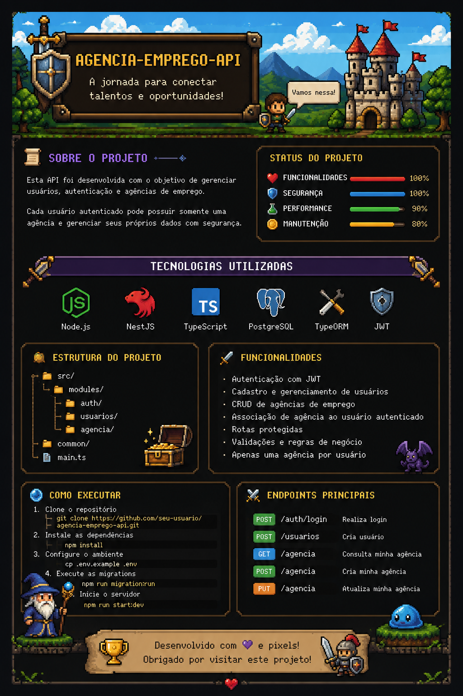

<!--
╔══════════════════════════════════════════════════════════════╗
║              🏰 RPG GITHUB PROFILE — RETRO MODE             ║
║          Pixel art • Dark fantasy • Old school RPG          ║
╚══════════════════════════════════════════════════════════════╝
-->

<!-- Banner principal: coloque assets/rpg-banner.png no repositório -->

 

  

🧙‍♂️ Sobre Mim

╭──────────────────────────────────────────────────────────────╮
│  PLAYER PROFILE                                              │
├──────────────────────────────────────────────────────────────┤
│  Nome       : Maria Clara                                    │
│  Classe     : Backend Developer                              │
│  Especial   : APIs • Banco de Dados • Git                    │
│  Arma       : VS Code + Terminal                             │
│  Elemento   : TypeScript / Go                                │
│  Quest      : Evoluir um commit por vez                      │
╰──────────────────────────────────────────────────────────────╯

Sou uma desenvolvedora em evolução, explorando principalmente backend, APIs, bancos de dados e desenvolvimento de software.

Meu objetivo é transformar cada projeto em uma nova fase da jornada: aprender, construir, testar, corrigir bugs e subir de nível. 🎮

⚔️ Tech Stack

🧪 Ferramentas utilizadas

🗺️ Projetos em Destaque

<table>
<tr>
<td width="50%" valign="top">

🏰 Agência Emprego API

API para gerenciamento de usuários, autenticação e agências de emprego.

Stack

NestJS TypeScript TypeORM PostgreSQL JWT

Status: 🟢 Em desenvolvimento

</td>

<td width="50%" valign="top">

🧪 Aprendendo Go

Repositório dedicado aos estudos de Go, exercícios, estruturas de dados, funções e lógica de programação.

Stack

Go Git GitHub

Status: 🟡 Em evolução

</td>
</tr>
</table>

🖥️ Objetivos Atuais

┌──(player㉿github)-[~/quests]
└─$ ./next-quest.sh

[████████████████████░░] 90%

> [✓] Aprender fundamentos de Go
> [✓] Trabalhar com Git e GitFlow
> [✓] Construir APIs com NestJS
> [✓] Trabalhar com PostgreSQL
> [✓] Implementar autenticação
> [→] Evoluir arquitetura backend
> [→] Criar projetos cada vez mais completos
> [ ] Dominar novas tecnologias
> [ ] Desbloquear próxima classe

STATUS: QUEST IN PROGRESS...

📊 Guild Stats

 

🏆 Hall da Fama

📈 Activity Map

🐍 Snake Quest

<!--
Para ativar a animação:
1. Crie .github/workflows/snake.yml
2. Use o workflow do repositório Platane/snk
3. O workflow deve gerar:
   dist/github-contribution-grid-snake.svg
   dist/github-contribution-grid-snake-dark.svg
-->

<picture>
  <source media="(prefers-color-scheme: dark)" srcset="https://raw.githubusercontent.com/mcsolon03/mcsolon03/output/github-contribution-grid-snake-dark.svg">
  <source media="(prefers-color-scheme: light)" srcset="https://raw.githubusercontent.com/mcsolon03/mcsolon03/output/github-contribution-grid-snake.svg">
  
</picture>

💾 Sistema de Skills

╔══════════════════════════════════════════════════════════╗
║                    CHARACTER BUILD                       ║
╠══════════════════════════════════════════════════════════╣
║                                                          ║
║  Backend        ███████████████████░░░  LV. 08          ║
║  TypeScript     █████████████████░░░░░  LV. 07          ║
║  Node.js        █████████████████░░░░░  LV. 07          ║
║  PostgreSQL     ███████████████░░░░░░░  LV. 06          ║
║  Git / GitFlow  ███████████████░░░░░░░  LV. 06          ║
║  Go             ███████████░░░░░░░░░░░  LV. 04          ║
║                                                          ║
╚══════════════════════════════════════════════════════════╝

🏹 INSERT COIN • PRESS START • BUILD SOMETHING AWESOME

⚔️ Desenvolvido com código, café e alguns bugs. ☕

© 2026 • Retro Developer Quest

